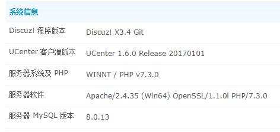

# Discuz! ML v3.5 (Discuz! ML MultiLingual)

## Introduction

Discuz!ML is a multilingual version of Discuz!X, social network engine from Tencent Cloud 

## v3.5 Fetures

Compared with version 3.4, the following modifications have been made:

#### 1. Database related changes

Version 3.5 supports InnoDB and MyISAM database engines.
Under both engines, the database no longer supports utf8 encoding, but instead supports utf8mb4 encoding.

##### 1.1 Changes to the database table structure:

Reference [scheme-change-without-data-loss.sql](https://gitee.com/oldhuhu/DiscuzX34235/blob/master/scheme/scheme-change-without-data-loss.sql)

  * Modified all IP addresses to varchar(45) type;
  * Added port number records where IP addresses are recorded;
  * In the pre_common_banned table, two VARBINARY(16) fields, upperip and lowerip, are added to record the maximum and minimum banned ranges of IP addresses
  * Change some fields to "big", such as INT to BIGINT, TEXT to MEDIUMTEXT, etc.
  * In order to support IPv6, all IP1/IP2/IP3/IP4 field definitions are removed, refer to [scheme-change-drop-columns.sql](https://gitee.com/oldhuhu/DiscuzX34235/blob/master/scheme/ scheme-change-drop-columns.sql)

##### 1.2 In order to support InnoDB related changes

For the InnoDB database engine, the following changes will be made, refer to [scheme-change-innodb.sql](https://gitee.com/oldhuhu/DiscuzX34235/blob/master/scheme/scheme-change-innodb.sql)
  * To support InnoDB, an index is added to the table pre_common_member_grouppm
  * In order to support InnoDB, in the table pre_forum_post, the auto_increment attribute of position is canceled

In the configuration file, a new related configuration item is introduced, which must be set correctly. Especially for upgraded users, otherwise the function of posting will be abnormal.

```
/*
 * Database engine, set according to your own database engine, the default is innodb after 3.5, and it was myisam before
 * For users who upgrade from 3.4 to 3.5 and have not converted the database engine, set it to myisam
 */
$_config['db']['common']['engine'] = 'innodb';
```


##### 1.3 Changes to support utf8mb4

For the MyISAM engine, due to the 1000-byte index length limit, some indexes need to be redefined, refer to [scheme-change-myisam-utf8mb4.sql](https://gitee.com/oldhuhu/DiscuzX34235/blob/ master/scheme/scheme-change-myisam-utf8mb4.sql)

Whether it is InnoDB or MyISAM, all tables use utf8mb4 encoding and utf8mb4_unicode_ci, refer to [scheme-change-charset.sql](https://gitee.com/oldhuhu/DiscuzX34235/blob/master/scheme/scheme-change-charset .sql)


#### 2. IP related changes

In version 3.5, in order to support IPv6, the following changes were made

##### 2.1 IP address library

The system now supports multiple address libraries, which can be selected through the following configuration items in the configuration file:

```
$_config['ipdb']['setting']['fullstack'] = ''; // The full-stack IP library used by the system has the highest priority
$_config['ipdb']['setting']['default'] = '';   // The default IP library used by the system, with the lowest priority
$_config['ipdb']['setting']['ipv4'] = 'tiny';  // The default IPv4 library used by the system, leave blank to use the default library
$_config['ipdb']['setting']['ipv6'] = 'v6wry'; // The default IPv6 library used by the system, leave blank to use the default library
```

The class corresponding to the address library is `ip_<name of the address library>`, which is located under `source/class/ip`. The system will automatically load the corresponding class according to the configuration, and the corresponding class can also have its own configuration items. The rules are:

```
 * $_config['ipdb'] can be used as a custom extended IP library setting option except setting, and you are welcome to PR your own extended IP library.
 * To set the extended IP library, please use the format:
 * $_config['ipdb']['extended ip library name']['setting item name'] = 'value';
 * for example:
 * $_config['ipdb']['redis_ip']['server'] = '172.16.1.8';
```

The system now has a built-in IPv4 library and an IPv6 library

##### 2.2 IP ban

Now the IP address is blocked, no longer use `*` as a wildcard, but use [subnet mask (CIDR)](https://cloud.tencent.com/developer/article/1392116) to specify the way to block address range.

The configuration of IP banning is now stored in the pre_common_banned table, and the check will be triggered every time a user visits. The current checking efficiency is higher, and only one indexed SQL query (based on VARBINARY type size comparison) will be generated each time. It doesn't pose a problem for general site performance. In addition, Redis caching can be enabled to further improve performance. There is also a configuration item to turn off this function, and use an external firewall to manage IP bans:

```
$_config['security']['useipban'] = 1; // Whether to enable/disable IP function, high-load sites can release this function to HTTP Server/CDN/SLB/WAF to reduce server pressure
```

##### 2.3 IP address acquisition

For IP address acquisition, only REMOTE_ADDR is trusted by default, and others are forbidden by default because they are too easy to forge. The acquisition method can also be expanded, and the following configuration items are added to the configuration file

```
/**
 * IP acquisition extension
 * Considering that different CDN service providers provide different strategies for judging CDN source IP, you can define your own service provider's IP acquisition extension.
 * If it is empty, the default system will be used. If it is not empty, the get method in source/class/ip/getter_value.php will be called automatically to obtain the IP address.
 * The system provides dnslist (IP anti-analysis domain name whitelist), serverlist (IP address whitelist, supports CIDR), header extension, please refer to the extension file for details.
 * Performance tips: The two built-in tools rely on RDNS, CIDR judgment and other operations, which have a great impact on system efficiency. It is recommended to use HTTP Server for large traffic sites
 * Or logic such as IP black and white list on CDN/SLB/WAF to implement CDN IP address white list, and then use header extension to specify the IP header provided by the service provider.
 * Security tip: Due to the independence and scalability of UCenter and UC_Client, you need to modify the relevant business logic of related files separately to realize this kind of function.
 * $_config['ipgetter'] can be used as a custom IP acquisition model setting option except setting, and you are welcome to PR your own extended IP acquisition model.
 * Extended IP acquisition model settings, please use the format:
 * $_config['ipgetter']['IP get extension name']['setting item name'] = 'value';
 * for example:
 * $_config['ipgetter']['onlinechk']['server'] = '100.64.10.24';
 */
$_config['ipgetter']['setting'] = '';
$_config['ipgetter']['header']['header'] = 'HTTP_X_FORWARDED_FOR';
$_config['ipgetter']['iplist']['header'] = 'HTTP_X_FORWARDED_FOR';
$_config['ipgetter']['iplist']['list']['0'] = '127.0.0.1';
$_config['ipgetter']['dnslist']['header'] = 'HTTP_X_FORWARDED_FOR';
$_config['ipgetter']['dnslist']['list']['0'] = 'comsenz.com';
```

#### 3. Caching

3.5 greatly enhances the support for Redis cache, and completely eliminates the use of memory tables when Redis is used. include:

* All the functions related to the original session memory table are all implemented by Redis
* setting is no longer loaded at one time, but loaded in batches on demand
* Cache the detection results of IP ban

It is recommended that all sites be configured with Redis caching enabled.

Due to the functional limitations of memcached, the above enhancements are not valid for memcached.

**Tips: Because PHP considers that objects that implement the ArrayAccess interface are not completely equivalent to arrays, the original plug-ins or secondary development sites that rely on array_key_exists should cancel their dependence on it. **

#### 4. Support all function switches including forums

3.5 now supports the switch of almost all functions, the administrator can even close the forum and only use the portal. Please click [PR291](https://gitee.com/Discuz/DiscuzX/pulls/291) for related modifications


#### 5. Other changes

* Added a test framework that can run in the background, the code is located under `upload/tests`, and test cases can be added under `upload/tests/class`. Welcome to submit test cases through Pull Request
* Modified the log output method of the last step of the installation program, and now the entire process log of creating the database can be displayed in real time
* no longer use the mysql driver, only use mysqli
* Built-in function_debug.php file, opened by `$_config['debug'] = 1`

#### 6. Minimum operating environment requirements

**Security Tips: We strongly recommend that you use software such as operating systems, web servers, PHP, databases, and memory caches that are still within the support period of the development team. Software beyond the support period may bring unknown security risks to your site . **
**Performance tip: When MySQL< 5.7 or MariaDB < 10.2, InnoDB performance drops more severely, so sites running on production systems should upgrade to MySQL >= 5.7 or MariaDB >= 10.2 to avoid this problem. **

| Software Name | Minimum Requirements | Recommended Version | Other Matters |
| ------- | ---------- | ----------- | --------------------------------------------------------------------- |
| PHP | >= 5.6.0 | 7.3 - 8.1 | Depends on XML extension, JSON extension, GD extension >= 1.0, PHP 8.0 - 8.1 is testing support |
| MySQL | >= 5.5.3 | 5.7 - 8.0 | For MariaDB, the recommended version is >= 10.2 |


### screenshot


### **Assisted Installation**

To make it easier for webmasters to build websites based on Discuz! ML, [Codersclub Team](https://codersclub.org/discuzx/) provides an installation of Discuz! ML for webmasters.
Just write your request at our forum.


### Installation and upgrade tutorial
Users who use the release version, check the readme.html file in the installation package.

[Upgrade tutorial](https://gitee.com/Discuz/DiscuzX/wikis/%E5%8D%87% E7%BA%A7%E6%96%B9%E6%B3%95?sort_id=9978)

!!!ToDo: Translate the Upgrade tutorial!!!

### Related Sites
 
- [Discuz! ML official site](https://codersclub.org/discuz.ml/)
- [Discuz! ML official forum](https://codersclub.org/discuzx/)
- [Discuz! ML repository at Github](https://github.com/codersclub/Discuz.ML)

### Chinese Related Sites
 
[Discuz! X official Git](https://gitee.com/Discuz/DiscuzX), Simplified Chinese UTF8 version

[Click to see how to submit code to Chinese project](https://gitee.com/Discuz/DiscuzX/wikis/%E6%8F%90%E4%BA%A4%E4%BB%A3%E7%A0%81% E5%88%B0%E6%9C%AC%E9%A1%B9%E7%9B%AE?sort_id=3466289)

[Download Discuz! X Chinese versions](https://gitee.com/Discuz/DiscuzX/attach_files)

[Discuz! X Official Site](https://www.discuz.vip/)

[Discuz! App Center](https://addon.dismall.com/)

[Discuz! Open Platform](https://open.dismall.com/)

[Discuz! Development Documentation](https://open.dismall.com/?ac=document&page=dev)


### Pay attention:
- Chinese repository has been switched to the X3.5 branch as default on May 21, 2023.
  The master branch (x3.4) no longer accepts PRs, please submit new PRs to X3.5.

